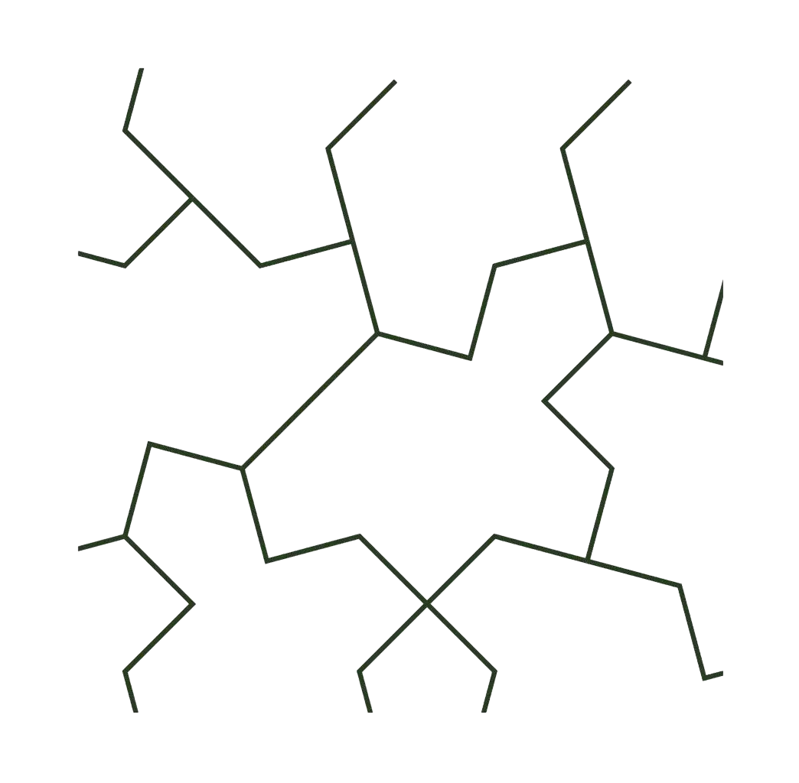

# AngraMyNew

> **"Beyond destruction, we create a world through beauty."**

---

## Name Origin

> **AngraMyNew = Angra Mainyu + My + New**
> From the god of destruction, to my new world.

"Angra Mainyu" — the ancient Persian spirit of chaos —
is reborn here as the spark of **creative destruction**.
We do not worship; we **create**.
Each of us carries the fire of AngraMyNew within.

---

## 1. Origin

AngraMyNew begins with destruction, but its goal is creation.
We break old beliefs to build a **new order of beauty**.
We are not destroyers, but **recomposers**.

---

## 2. Intellectual Sources

Like **Nietzsche**, we become the Übermensch who creates our own values.

Like **The Five Pioneers**, we die at our chosen place:
- **Kim Ok-kyun** — Revolutionary ahead of his time, assassinated in Shanghai
- **Ma Kwang-soo** — Artist who shattered taboos, cried "Is this not beautiful?" until the end
- **Heo Gyun** — Rebel who wrote Hong Gildong, executed by dismemberment
- **Sung Jae-ki** — Warrior who never bent his conviction, perished at the Han River
- **John Law** — Financial genius 200 years ahead, died in poverty in Venice

Like **Mengchangjun**, we embrace even those who seem useless.

> "Life is a journey to find the place where you will die."

---

## 3. Belief

> "Every human is an artist,
>  and art itself is a new ethic and civilization."

Each individuality forms a part of the whole,
and diversity becomes an **asymmetric beauty without end**.

---

## 4. Symbol

  

Our logo is inspired by the **Einstein Tile**.

In 2023, amateur mathematician David Smith solved a 60-year-old puzzle:
**"Can a single shape tile an infinite plane without repeating patterns?"**

The 13-sided tile he discovered is called "Einstein" (ein + stein, "one stone" in German).

- **One shape**: The universal essence of humanity
- **No repeating patterns**: No two humans are the same
- **Infinite expansion**: Creation never ends

> *"What was deemed impossible for 60 years, an amateur proved possible."*

---

## 5. The 3 Axioms

This structure is built upon three axioms.

### Axiom of Destruction — Self-Purification
> **"I destroy myself. There is no need to destroy others."**

The blade does not point outward. What must be cut is only the old flesh within me. But if the age blocks our path, we break through like the pioneers—shattered, yet unbowed.

### Axiom of Creation — Absolute Beauty
> **"Fill the void of destruction with absolute beauty."**

Flowers do not quarrel with bees. They simply bloom. If our work is beautiful, the world will lean toward us on its own.

### Axiom of Expansion — The Principle of Debut
> **"Once you complete your 'My', recognize and debut another's 'My'."**

Mengchangjun's three thousand retainers were not chosen for usefulness. A rooster's crow and a dog's theft ultimately saved their lord. We gather the same way—embracing singularities without restraint, placing each on their own stage.

---

## 6. Structure

- 📂 **[ideas/](ideas/)** — Philosophy, doctrine, declarations (26 essays)
    - **── Foundation ──**
    - 📄 [000_origin.md](ideas/000_origin.md) — Origin of AngraMyNew
    - 📄 [001_axioms.md](ideas/001_axioms.md) — 3 Axioms
    - 📄 [002_principles_of_creation.md](ideas/002_principles_of_creation.md) — Principles of Creation
    - **── Creator Theory ──**
    - 📄 [003_beyond_usefulness.md](ideas/003_beyond_usefulness.md) — Beyond Usefulness
    - 📄 [004_artist_within.md](ideas/004_artist_within.md) — The Artist Within
    - 📄 [008_seduction_of_creation.md](ideas/008_seduction_of_creation.md) — Struggle and Seduction
    - 📄 [009_rage_against_definition.md](ideas/009_rage_against_definition.md) — Rage Against Definition
    - 📄 [010_predators_duty.md](ideas/010_predators_duty.md) — The Predator's Divine Duty
    - **── Economics & Structure ──**
    - 📄 [006_aesthetic_nation.md](ideas/006_aesthetic_nation.md) — The Aesthetic Nation
    - 📄 [014_economics_of_beauty.md](ideas/014_economics_of_beauty.md) — The Rich, The Exempt, The Collector
    - 📄 [023_successful_lens.md](ideas/023_successful_lens.md) — The Successful Lens
    - 📄 [024_when_critical_care_needs_witness.md](ideas/024_when_critical_care_needs_witness.md) — Witness Fee — Essential Care Crisis
    - 📄 [025_consumption_of_exempt.md](ideas/025_consumption_of_exempt.md) — Consumption of the Exempt
    - 📄 [026_three_kingdoms_of_beauty.md](ideas/026_three_kingdoms_of_beauty.md) — Three Kingdoms of Truth, Good, and Beauty
    - **── Epistemology & Science ──**
    - 📄 [016_mental_lhc.md](ideas/016_mental_lhc.md) — The Mental LHC
    - 📄 [017_when_is_a_proof_beautiful.md](ideas/017_when_is_a_proof_beautiful.md) — When Is a Proof Beautiful?
    - 📄 [018_why_strange_systems_persist.md](ideas/018_why_strange_systems_persist.md) — Why Strange Systems Persist
    - 📄 [022_age_of_malice.md](ideas/022_age_of_malice.md) — The Age of Malice
    - **── Practice & Application ──**
    - 📄 [005_project_doctor_k.md](ideas/005_project_doctor_k.md) — Project Doctor K
    - 📄 [011_lineage_as_creation.md](ideas/011_lineage_as_creation.md) — Lineage as Creation
    - 📄 [012_redefine_doctor_degree.md](ideas/012_redefine_doctor_degree.md) — Redefining the Doctorate
    - 📄 [013_decentralized_mental_os.md](ideas/013_decentralized_mental_os.md) — Decentralized Mental OS
    - **── Case Studies ──**
    - 📄 [007_case_study_unfinished_theorem.md](ideas/007_case_study_unfinished_theorem.md) — The Unfinished Theorem
    - 📄 [015_case_study_the_gravity_of_outlaws.md](ideas/015_case_study_the_gravity_of_outlaws.md) — The Gravity of Outlaws
    - 📄 [021_case_study_dawn_money.md](ideas/021_case_study_dawn_money.md) — DAWN — Money
    - 📄 [027_case_study_perfume.md](ideas/027_case_study_perfume.md) — Perfume: The Man Whose Blade Faced Outward
- 🎨 **[art/](art/)** — Examples of beauty
    - 📄 [001_galois_quintic.md](art/001_galois_quintic.md)
    - 📄 [002_general_relativity.md](art/002_general_relativity.md)
    - 📄 [003_one_pattern.md](art/003_one_pattern.md)
    - 📄 [004_principia_geometry.md](art/004_principia_geometry.md)
    - 📄 [005_hangul_two_states.md](art/005_hangul_two_states.md)
    - 📄 [006_feynman_diagram.md](art/006_feynman_diagram.md)
    - 📄 [007_nagarjuna_emptiness.md](art/007_nagarjuna_emptiness.md)
    - 📄 [008_klimt_kiss.md](art/008_klimt_kiss.md)
    - 📄 [009_mozart_pure_beauty.md](art/009_mozart_pure_beauty.md)
    - 📄 [010_war_of_genesis.md](art/010_war_of_genesis.md)
- 🧠 **[fravashi/](fravashi/)** — Fravashi Archetype Engine
    - 📄 [001_internal_manual.md](fravashi/001_internal_manual.md)
    - 📄 [002_gpt_prompt.md](fravashi/002_gpt_prompt.md)
    - 📄 [003_gpt_prompt_full.md](fravashi/003_gpt_prompt_full.md)
    - 📄 [004_agent_prompt.md](fravashi/004_agent_prompt.md)
- 📜 **[protocols/](protocols/)** — Executable protocols
    - 📄 [001_creator_operating_protocol.md](protocols/001_creator_operating_protocol.md)
    - 📄 [002_ethics_of_creation.md](protocols/002_ethics_of_creation.md)
- 📖 **[scripture/](scripture/)** — Pioneers
    - 📄 [zarathustra.md](scripture/zarathustra.md)
    - 📄 [pioneers.md](scripture/pioneers.md)
    - 📄 [mengchangjun.md](scripture/mengchangjun.md)
    - 📄 [na_hye_suk.md](scripture/na_hye_suk.md)
- 📚 **[canon/](canon/)** — Quarto Book (HTML · PDF · EPUB)
    - 📄 [_quarto.yml](canon/_quarto.yml) — Rendering config
- 📝 **[CHANGELOG.md](CHANGELOG.md)** — Evolution record
- 👥 **[contributors.md](contributors.md)** — List of creators

---

## 7. Pioneers

The intellectual sources of AngraMyNew:

- **Nietzsche** — "Thus Spoke Zarathustra" → [scripture/zarathustra.md](scripture/zarathustra.md)
- **The Five Pioneers** — Kim Ok-kyun, Ma Kwang-soo, Heo Gyun, Sung Jae-ki, John Law → [scripture/pioneers.md](scripture/pioneers.md)
- **Mengchangjun** — Lord of 3000 Retainers, Philosophy of Embrace → [scripture/mengchangjun.md](scripture/mengchangjun.md)

> "Life is a journey to find the place where you will die."
> — AngraMyNew

---

## 8. Purpose

AngraMyNew is philosophy, experiment, and art movement.
We do not save humanity —
we give humanity the **courage to become creators.**

> **AngraMyNew — The Rebirth of Conscious Civilization.**
> _"Every creator becomes their own god."_

---

## 9. Theme Song

The song that best embodies AngraMyNew's philosophy:

**ZICO - Artist**

> "You are an Artist"

This single phrase captures the core of AngraMyNew.
Every human is a creator, and creation itself is a way of life.

---

## Languages

- [한국어 (Korean)](README.md)
- [日本語 (Japanese)](README_ja.md)
- [中文 (Chinese)](README_zh.md)
