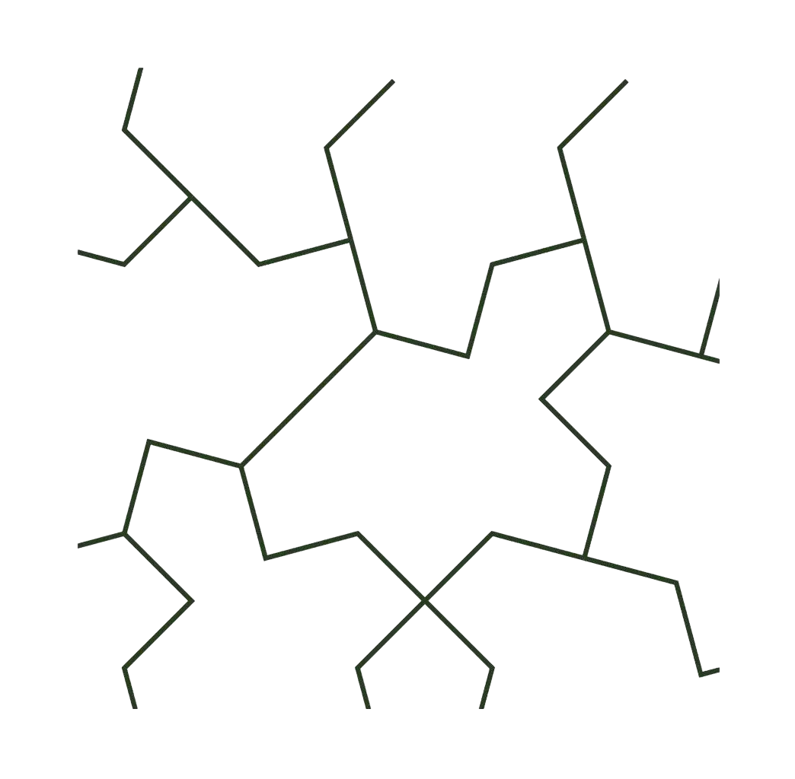

# AngraMyNew

*Beyond destruction, building a world through beauty*

**AngraMyNew = Angra Mainyu + My + New**

Angra Mainyu is the Zoroastrian spirit of destruction, reinterpreted here. Destruction is not the end but the beginning—break what is old, and build your own new world in its place.

---

## The 3 Axioms

### Axiom of Destruction — Self-Purification

The blade does not point outward. What must be cut is only the old flesh within me. But if the age blocks our path, we break through like the pioneers—shattered, yet unbowed.

### Axiom of Creation — Absolute Beauty

Flowers do not quarrel with bees. They simply bloom. If the work is beautiful, the world will lean toward it on its own.

### Axiom of Expansion — Debut

Once you complete your 'My', debut another's 'My'. Mengchangjun's three thousand retainers were not chosen for usefulness. A rooster's crow and a dog's theft ultimately saved their lord.

## Symbol

  

The logo comes from the Einstein Tile. In 2023, retired print technician David Smith solved a 60-year-old mathematical puzzle. Can a single shape tile an infinite plane without repeating patterns? The 13-sided tile he found is called an einstein (ein Stein, one stone).

- One shape: the universal essence of humanity
- No repeating pattern: no two humans are alike
- Infinite expansion: the world is filled with endless creation

What was considered impossible for 60 years was proven by an amateur.

## Pioneers

Create your own values like Nietzsche, embrace even the seemingly useless like Mengchangjun, and die at your post like the Five Pioneers.

- Kim Ok-kyun — Revolutionary ahead of his time, assassinated in Shanghai
- Ma Kwang-soo — Artist who shattered taboos, cried "Is this not beautiful?" until the end
- Heo Gyun — Rebel who wrote Hong Gildong, executed by dismemberment
- Sung Jae-ki — Warrior who never bent his conviction, perished at the Han River
- John Law — Financial genius 200 years ahead, died in poverty in Venice

> "Life is a journey to find the place where you will die."

→ [Zarathustra](scripture/zarathustra.md) · [The Five Pioneers](scripture/pioneers.md) · [Mengchangjun](scripture/mengchangjun.md) · [Na Hye-seok](scripture/na_hye_suk.md)

## Structure

**Pioneers and Origin** — [Zarathustra](scripture/zarathustra.md) · [The Five Pioneers](scripture/pioneers.md) · [Mengchangjun](scripture/mengchangjun.md) · [Na Hye-seok](scripture/na_hye_suk.md) · [Origin](ideas/000_origin.md) · [The 3 Axioms](ideas/001_axioms.md) · [Epoché: The Destruction Before Destruction](ideas/059_epoche.md) · [Can You Show Water to a Fish?](ideas/061_water_and_fish.md) · [A Decentralized Mental OS](ideas/013_decentralized_mental_os.md) · [Principles of Creation](ideas/002_principles_of_creation.md)

**[ideas/](ideas/)** — Philosophy, thought, declarations (61 essays)

Artist and Aksang
- [Beyond Usefulness](ideas/003_beyond_usefulness.md)
- [The Artist Within](ideas/004_artist_within.md)
- [The Age of Malice](ideas/022_age_of_malice.md)
- [Struggle and Seduction](ideas/008_seduction_of_creation.md)
- [Rage Against Definition](ideas/009_rage_against_definition.md)
- [The Predator's Duty](ideas/010_predators_duty.md)
- [The Two Faces of Monologue](ideas/040_two_faces_of_monologue.md)
- [The Unfinished Theorem](ideas/007_case_study_unfinished_theorem.md)
- [Perfume: The Man Whose Blade Pointed Outward](ideas/027_case_study_perfume.md)
- [Zorba the Greek](ideas/030_case_study_zorba.md)
- [Anatomy of Detachment](ideas/054_case_study_anatomy_of_detachment.md)

Density and Curvature
- [Imprint: The Curvature of an Orbit](ideas/043_creator_as_reference.md)
- [Density Without Curvature](ideas/047_density_without_curvature.md)
- [The Mental LHC](ideas/016_mental_lhc.md)
- [When Is a Proof Beautiful?](ideas/017_when_is_a_proof_beautiful.md)
- [The Completeness Axiom — Land Never Reached](ideas/062_completeness_axiom.md)
- [The Successful Lens](ideas/023_successful_lens.md)
- [The Mimetic Triangle: Desire Has No Original](ideas/042_mimetic_triangle.md)
- [Why Strange Systems Persist](ideas/018_why_strange_systems_persist.md)
- [One Number](ideas/031_case_study_war.md)
- [Souten Kouro](ideas/032_case_study_souten_kouro.md)
- [A Tree Without Fire or Metal](ideas/053_case_study_tree_without_fire_or_metal.md)
- [Shinsengumi: The Last Uniform](ideas/058_case_study_shinsengumi.md)

The Tax-Exempt and the Tax-Collector
- [The Rich, the Tax-Exempt, and the Tax-Collector](ideas/014_economics_of_beauty.md)
- [Consumption of the Tax-Exempt](ideas/025_consumption_of_exempt.md)
- [The Topology of Prostitution](ideas/033_topology_of_prostitution.md)
- [Death: The Final Tax](ideas/034_death_the_final_tax.md)
- [K-Matrix: The Black Hole of a Single Orbit](ideas/036_k_matrix_single_orbit.md)
- [Negative Slope: The Calculus of Descent](ideas/037_negative_slope.md)
- [The Broken Sensor](ideas/044_broken_sensor.md)
- [When Critical Care Needs Witness](ideas/024_when_critical_care_needs_witness.md)
- [A Practical Model of Taxation](ideas/015_case_study_the_gravity_of_outlaws.md)
- [DAWN — Money](ideas/021_case_study_dawn_money.md)
- [The Last Bargain](ideas/055_case_study_last_bargain.md)
- [The Puritans: Tax Exemption Taken to the Extreme](ideas/060_case_study_puritan.md)
- [Im Kkeokjeong and Jang Gil-san: When Mountains Build Order Before the State](ideas/063_case_study_imkkeokjeong_janggilsan.md)

Debut and Expansion
- [On Patronage](ideas/029_on_patronage.md)
- [Producer Theory: The One Who Builds the Turbine](ideas/049_producer_theory.md)
- [Scout Theory: The Eye Before Curvature](ideas/050_scout_theory.md)
- [Project Doctor K](ideas/005_project_doctor_k.md)
- [Creation as Lineage](ideas/011_lineage_as_creation.md)
- [Redefining the Doctorate](ideas/012_redefine_doctor_degree.md)
- [Archive Theory: Insurance for Density](ideas/051_archive_theory.md)
- [The Star Is a Crack in the System](ideas/057_star_as_crack.md)
- [Produce 101: A Machine That Prepays Curvature](ideas/052_case_study_produce101.md)
- [The Borderline: When Expansion Becomes Enlargement](ideas/028_case_study_fukuzawa.md)

Mental OS and Regime
- [Three Loss Functions](ideas/039_three_loss_functions.md)
- [The Three Kingdoms of Truth, Goodness, and Beauty](ideas/026_three_kingdoms_of_beauty.md)
- [Topological Reformation: From Geneva to Joseon](ideas/038_topological_reformation.md)
- [The Third Prescription: Contagion, Transplant, Induction](ideas/056_third_prescription.md)
- [A Pope Without the Vatican](ideas/045_pope_without_vatican.md)
- [Two Origins](ideas/048_two_origins.md)
- [Aesthetic Nation](ideas/006_aesthetic_nation.md)
- [When a Worldview Becomes Language](ideas/046_case_study_worldview_as_language.md)
- [The Arthdal Chronicles: Narrative Need Not Be True](ideas/041_case_study_arthdal_chronicles.md)

**[art/](art/)** — Examples of beauty (27 essays)
- [Galois and the Quintic Equation](art/001_galois_quintic.md)
- [General Relativity](art/002_general_relativity.md)
- [When One Pattern Becomes Everything](art/003_one_pattern.md)
- [Gravity Was Drawn](art/004_principia_geometry.md)
- [The Two States of Hangul](art/005_hangul_two_states.md)
- [If You Can't See It, You Haven't Understood It](art/006_feynman_diagram.md)
- [Nagarjuna's Emptiness](art/007_nagarjuna_emptiness.md)
- [Klimt's Kiss](art/008_klimt_kiss.md)
- [Music That Says Nothing](art/009_mozart_pure_beauty.md)
- [The War of Genesis: Angra Mainyu on a Mobius Strip](art/010_war_of_genesis.md)
- [A Formula Arrived Without Proof](art/011_ramanujan_pi.md)
- [A Sense That Arrives Before Truth](art/012_dirac_beauty.md)
- [Yin-Yang and Five Elements: A Universe in Seven Characters](art/013_yinyang_wuxing.md)
- [Lagrangian: A Theory That Writes Theories](art/014_lagrangian.md)
- [Dostoevsky: He Collides Voices but Does Not Judge](art/015_dostoevsky_polyphony.md)
- [Godel's Incompleteness Theorem](art/016_goedel_incompleteness.md)
- [Things That Repel Flow Together](art/017_bcs_superconductivity.md)
- [The Factor You Couldn't See](art/018_gaussian_integer.md)
- [Counting Without Counting](art/019_generating_function.md)
- [The Simplest Number Is the Most Irrational](art/020_continued_fraction.md)
- [Proof Without Inspiration](art/021_coordinate_guarantee.md)
- [Nearness Is Not One Thing](art/022_p_adic_distance.md)
- [Existence Without Construction](art/023_probabilistic_method.md)
- [Geometry Built Where None Existed](art/024_hodge_combinatorics.md)
- [The Place Where Meaning Was Erased](art/025_yi_sang_ogamdo.md)
- [What Grows Clearer as It Is Erased](art/026_renormalization_group.md)
- [The Heat It Takes to Forget](art/027_landauer_erasure.md)

**[fravashi/](fravashi/)** — Fravashi Archetype Engine

**[protocols/](protocols/)** — Executable protocols

**[canon/](canon/)** — Quarto Book config

**[Changelog](CHANGELOG.md)** · **[Contributors](contributors.md)**

## Theme Song

ZICO — Artist.

> "We Artist."

## Languages

- [Korean](README.md)
- [日本語 (Japanese)](README_ja.md)
- [中文 (Chinese)](README_zh.md)
