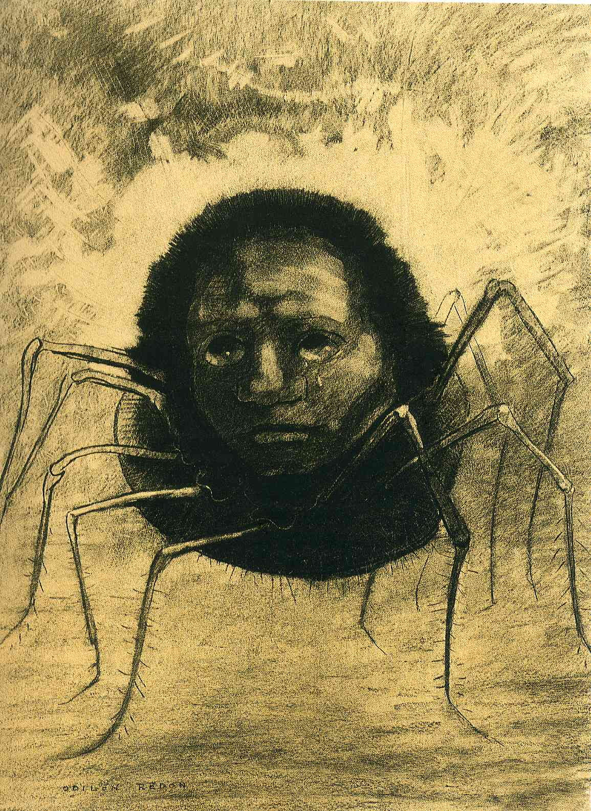
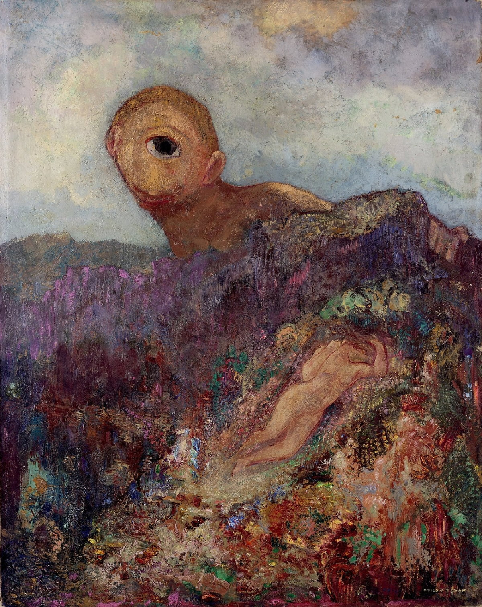
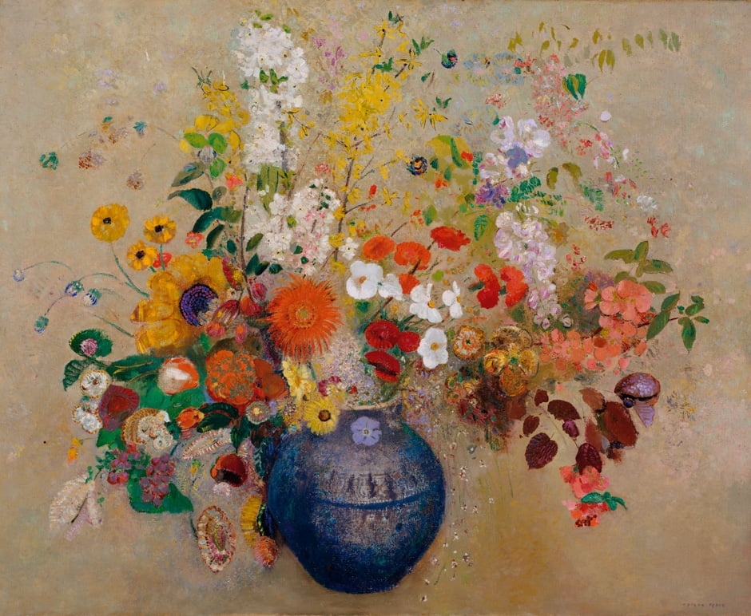

# 검은 그림이 색을 얻기까지

*— 오딜롱 르동의 Noir*

---

## 검은 시절

오딜롱 르동(1840–1916)은 서른이 넘도록 아무것도 이루지 못한 남자였다. 뇌전증을 앓았다는 이유로 어린 시절 친척 집에 맡겨졌고, 돌아온 뒤에도 가족 안에 그의 자리는 없었다. 아버지는 그림에 재능이 없다며 건축을 시켰고, 입시에 떨어졌다. 당대 최고의 사실주의 화가 제롬의 화실에 들어갔지만, 제롬은 상상력을 담은 르동의 그림을 볼 때마다 "이것도 그림이냐"고 호통쳤다. 르동은 짐을 싸서 집으로 돌아왔고, 아버지는 긴 한숨을 내쉬었다. 주변의 평가는 한마디로 정리됐다. "자신감이 없고 실패를 병적으로 두려워한다."

이 남자가 나중에 모네, 고흐, 세잔과 어깨를 나란히 한다는 찬사를 받게 된다.

## 칼날이 안으로 향한 순간

전환점은 1874년 아버지의 죽음이었다. 무섭기만 했던 아버지가 떠나고 나서야 르동은 기억을 다시 꺼냈다. 페이를르바드에 찾아와 함께 구름을 바라보며 다정한 말을 건넸던 아버지, 수많은 실패에도 지원을 멈추지 않았던 아버지. 르동은 자서전에 이렇게 썼다. "나는 아버지에 대해 많은 걸 오해하고 있었다."

그리고 더 깊은 깨달음이 왔다. 모든 우울의 책임을 다른 사람에게 돌리고 있었다는 것. 자기 인생은 자기만이 구원할 수 있다는 것. 르동은 썼다. "그때부터 나는 나 자신을 위해, 오직 나만을 위해, 나를 기쁘게 하기 위해 그림을 그리기 시작했다."

아버지의 승인, 제롬의 인정, 살롱의 평가 — 바깥의 기준에서 빠져나온 순간이었다. 르동은 더 이상 누군가에게 인정받기 위해 그리지 않았다. 무엇을 그릴지 결정하는 권한이 바깥에서 안으로 넘어왔다.

## Noir

{width=40% fig-align="center"}

르동은 이때부터 '누아르'(Noir)로 불리는 검은 그림들을 본격적으로 그리기 시작했다. 악몽에서 막 튀어나온 듯한 괴물, 눈알 풍선, 우는 거미, 황폐한 풍경. 흑백만 썼다. "꿈과 상상의 세계는 어둠에서 나오니 흑백으로도 충분하고, 색을 써봤자 눈만 어지러워질 뿐"이라는 판단이었다.

중요한 건 이 그림들이 고통의 방출이 아니었다는 점이다. 르동은 자기가 어떤 어둠 안에 있는지를 정확히 알고 있었다. "세상에는 말이나 음악으로는 표현할 수 없는 게 있다. 바로 내 내면의 풍경을 그림으로 보여줄 거야." 르동의 누아르는 울부짖음이 아니라 내면의 지도 제작이었다.

처음에는 "징그럽다"는 반응뿐이었다. 하지만 관객은 점차 빠져들기 시작했다. 르동의 그림이 내면의 기괴한 풍경을 눈에 보이는 것으로 바꿔놓았기 때문이다.

## 색은 보상이 아니라 결과였다

마흔에 결혼하고, 마흔아홉에 아들이 태어났다. 르동의 그림에 색이 들어오기 시작한 것은 이 무렵이다. 얼핏 보면 인생이 좋아져서 그림도 밝아진 것 같다. 하지만 순서가 다르다.

르동은 검은 그림으로 20년 가까이 자기 내면을 통과했다. 어둠을 회피하지 않고, 직시하고, 형상화하고, 반복적으로 마주했다. 결혼과 아들이 색을 촉발한 것은 사실이지만, 그것만으로는 설명이 안 된다. 20년의 누아르가 없었다면 색을 받아들일 바닥이 없었을 것이다. 파괴를 건너뛴 창조는 없다. 르동의 궤적이 그것을 시사한다.

꽃 그림은 그 변화의 가장 선명한 표현이었다. 몽환적인 내면을 그린다는 점은 누아르와 같았지만, 이제 그 내면에 꽃이 피어 있었다. 황무지에서 피운 꽃이기에 가벼운 장식이 아니었다. 평론가들은 이렇게 썼다. "우리 미술계는 반 고흐, 세잔, 쇠라만큼이나 르동에게 큰 빚을 졌다."

## 괴물을 끌어안다

1914년, 르동은 마지막 키클롭스를 그렸다. 그리스 신화의 외눈박이 거인. 30년 전에도 같은 소재를 그린 적이 있었다. 1883년의 키클롭스는 흑백이고 흉측했다. 1914년의 키클롭스는 총천연색이고, 무방비 상태의 소녀를 바라보는 거인의 눈에는 따스함이 있었다.

{width=50% fig-align="center"}

같은 괴물을 다시 그렸지만 시선이 달라져 있었다. 과거의 자신을, 그 어둡고 기괴하고 버림받았던 자신을 따뜻하게 바라보는 그림. 이 그림을 그리고 2년 뒤, 르동은 76세에 눈을 감았다.

죽기 4년 전 편지에서 르동은 이렇게 썼다. "예술이 예술가의 인생을 표현하는 노래라면, 나는 색채로 행복한 음을 만들어냈습니다."

## 맺음

{width=50% fig-align="center"}

르동이 아름다운 이유는 꽃을 잘 그려서가 아니다.

검은 그림을 끝까지 그렸기 때문이다. 어둠을 돌아가지 않고 통과했기 때문이다. 그리고 통과한 뒤에 색이 왔을 때, 그 색이 도피가 아니라 도착이었기 때문이다. 누아르 없는 꽃은 장식이다. 르동의 꽃이 가벼워 보이지 않는 이유는 그 아래에 20년의 검은 그림이 깔려 있기 때문이다.

> 어둠을 돌아가면 색이 오지 않는다. 통과해야 온다.
>
> 1883년의 괴물과 1914년의 괴물은 같은 얼굴이다. 달라진 것은 얼굴이 아니라 시선이다.

## 관련 문서

- [창조의 원리](../ideas/002_principles_of_creation.md) — 파괴 없는 창조는 없다
- [향수: 칼날이 밖을 향한 남자](../ideas/027_case_study_perfume.md) — 그르누이는 이 흐름을 모른 채 칼날을 밖으로 향했다. 르동은 안으로 향했다
- [독백의 두 얼굴](../ideas/040_two_faces_of_monologue.md) — 누아르는 배설이 아니라 편집이다. 구획을 인식한 자만이 내면을 지도로 그릴 수 있다
- [기축통화](../ideas/065_reserve_currency.md) — 르동은 내면의 풍경이라는 단위를 발행했고, 상징주의가 그 단위를 채택했다
