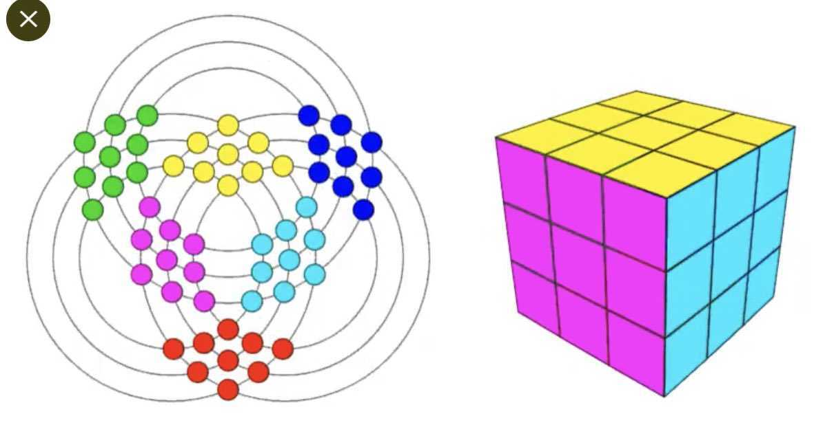

# 입체는 평면에 남는다

> *"본체를 직접 붙잡지 않고, 본체를 가능하게 하는 관계를 붙잡는다."*

[{width=60%}](https://youtu.be/MOWYDw98Pd4)

---

## 색이 아니라 회전

루빅스 큐브는 누구에게나 색 맞추기 퍼즐이지만, 수학자가 보면 하나의 군(group)이다. 규칙이라고는 여섯 면의 회전이 전부인데, 그 여섯 동작만으로 도달할 수 있는 상태가 약 4325경(4.3×10¹⁹) 가지에 이른다. 손가락으로 돌리는 여섯 개의 규칙에서, 우주의 나이를 초로 세어도 모자랄 숫자가 솟아나는 것이다.

그러니 큐브의 본체는 색이 아니라, 색을 옮기는 회전들과 그 회전들이 짜는 관계다. 거대함이란 복잡한 규칙에서 오는 것이 아니라 적은 생성원에서 오는 법이어서, [하나의 무늬](003_one_pattern.md)가 평면 전체를 채우듯 여섯 번의 회전이 그만한 우주를 연다.

## 입체가 평면에 남는다

3차원 큐브를 2차원 전개도 위에 옮기면 겉보기에는 납작해지지만, 회전 규칙만큼은 사라지지 않아서 평면 위에서도 똑같이 돌고 똑같이 풀린다. 2차원 표면이 3차원의 상태공간을 통째로 담는 것은 아니어도, 적어도 그 상태를 움직이는 규칙만큼은 평면 위에 고스란히 보존되는 셈이다.

홀로그램이 바로 그렇다. 3차원 물체의 정보가 2차원 표면에 간섭무늬로 저장되었다가 빛을 쏘면 다시 입체로 일어서는데, 이것은 차원을 줄인 것이 아니라 차원을 표면에 암호화한 것이다. 큐브의 전개도 역시 단순한 그림이 아니라, 입체의 회전 규칙이 평면 위에 살아남은 작은 홀로그램이다.

그래서 차원을 내리는 일은 무언가를 잃는 것이 아니라 오히려 드러내는 일이 되는데, 입체에서는 보이지 않던 세 겹의 대칭이 평면에서야 한눈에 들어오는 것처럼 [세부가 지워진 자리](026_renormalization_group.md)에서 본질이 떠오른다.

## 신의 수

상태는 4325경 가지인데, 깊이는 스무 수다. 아무리 엉킨 큐브라도 스무 번의 회전이면 풀리는데, 4325경 가지를 하나도 빠짐없이 헤아려 2010년에 증명해 낸 한계여서 신의 수(God's number)라 부른다. 가장 멀리 도망친 무질서조차 원점에서 스무 걸음 거리다. 무질서는 넓지만 깊지 않다.

## 본체가 아니라 관계

여기서 [갈루아](001_galois_quintic.md)가 들어온다. 갈루아는 5차방정식을 풀기 위해 해(解) 자체를 들여다보는 대신 해들 사이의 변환과 그 대칭을 보았고, 그 대칭이 이루는 군이 가해(solvable)가 아니라는 데서 근의 공식으로는 풀 수 없음을 증명했다.

분야는 대수와 퍼즐과 광학으로 제각각이지만, 세 가지를 나란히 두면 같은 손놀림이 보인다.

- 갈루아는 해가 아니라, 해들 사이의 변환을 잡는다.
- 큐브는 색이 아니라, 회전들이 만드는 군을 잡는다.
- 홀로그램은 물체가 아니라, 표면에 남은 간섭을 잡는다.

셋 다 본체를 직접 붙잡는 대신 본체를 가능하게 하는 관계를 붙잡으며, 그래서 '푼다'는 말의 뜻마저 갈라진다. 갈루아의 풀이가 답을 적어 내는 닫힌 공식이라면 큐브의 풀이는 원점으로 돌아가는 회전의 경로여서, 공식은 본체를 적으려 하고 경로는 관계를 따라간다. 물론 둘이 같은 종류의 문제는 아니지만 본체가 아니라 허용된 변환을 본다는 점에서는 닮았으니, 한쪽에서 '불가능'인 것이 다른 쪽에서는 '스무 수'다.

## 맺음

입체는 사라지지 않고 평면 위의 관계로 남았다. 본체를 손에 쥐려 하면 차원이 줄어드는 순간 무너지고 말지만, 관계를 붙잡은 사람은 차원이 줄어도 잃지 않는다. 이것이 갈루아와 큐브와 홀로그램이 함께 보여주는 하나의 미학이다.

## 관련 문서

- [갈루아와 5차방정식](001_galois_quintic.md)
- [하나의 무늬가 전부가 되다](003_one_pattern.md)
- [지울수록 또렷해지는 것](026_renormalization_group.md)
