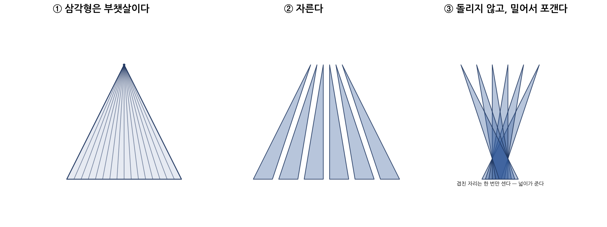

# 아무것도 차지하지 않으면서 모든 방향을 품는다
*— 부피는 0인데 차원은 3인 카케야 집합*

---

## 바늘 하나 돌리기

1917년 카케야 소이치(掛谷宗一)가 물었다. 길이 1인 바늘을 평면 위에서 180도 돌리려면 최소 얼마의 넓이가 필요한가. 지름 1인 원이라면 가능하니 0.785이고 도형을 잘 고르면 더 줄일 수 있다.

베시코비치(Besicovitch)의 답은 뜻밖에도 최솟값이 없다는 것이었다. 넓이를 0으로 만들 수는 없지만 얼마든지 0에 가깝게 줄일 수 있다.

그는 1919년 더 강한 집합을 만들었다. 모든 방향의 단위선분을 담으면서 넓이는 0인 집합이다. 이 집합을 카케야 집합이라 부른다.

## 겹침은 넓이를 먹고, 평행이동은 방향을 지킨다

구성의 심장은 삼각형 하나다.

높이 1인 삼각형의 꼭짓점에 바늘 머리를 고정한다. 바늘 끝을 밑변의 한쪽 끝에서 다른 끝까지 움직이면 바늘은 그 사이의 모든 각도를 지난다.

밑변을 나누고 각 경계점을 꼭짓점과 이으면 삼각형이 여러 조각으로 갈라진다. 바늘이 지나간 각도도 조각들에 나뉜다. 이 조각들을 옆으로 밀어 포개면 넓이는 줄지만 각도는 그대로다.

{width=100%}

겹침은 넓이를 줄이고, 평행이동은 방향을 지킨다.

조각을 더 잘게 나누고 포갤수록 넓이는 0에 가까워지지만 방향은 남는다. 이 구성을 돌려 이어 붙이면 180도의 모든 방향이 채워진다.

## 두 개의 자

그래서 이 집합은 없는 것인가. 부피로 재면 그렇다. 공간을 얼마나 차지하는가라는 질문에 답은 0이다.

차원은 다른 것을 본다. 작은 상자로 덮어 보면 선분은 $1/\varepsilon$개, 정사각형은 $1/\varepsilon^2$개, 덩어리는 $1/\varepsilon^3$개가 필요하다. 상자가 작아질수록 필요한 개수가 얼마나 빨리 늘어나는지, 그 지수가 차원이다.

그렇다면 모든 방향을 담은 카케야 집합은 어떻게 읽힐까. 부피는 0인데, 차원도 낮을까.

## 증명

평면에서는 1971년에 차원이 2임이 증명됐다. 3차원 문제는 2025년 홍 왕과 조슈아 잘이 풀었고, 이듬해 래리 거스가 합류한 짧은 증명이 나왔다. 

결론은 부피 0, 차원 3이다. 아무리 잘게 나누고 포개도 모든 방향을 담고 있다면 차원은 줄지 않는다.

## 확장의 자

확장은 몸집으로 재 왔다. 직원 수, 신도 수, 매출, 영향권. 그러나 중앙이 비워지는 것이 확장의 완성이라면, 몸집은 더 이상 답이 아니다. 내가 사라진 뒤 몇 개의 방향이 남는가. 카케야는 그 질문에 다른 자를 건넨다.

내가 차지한 부피가 아니라, 나 없이 열린 방향을 센다. 사람을 모아 같은 곳을 보게 하는 것은 부피를 키우는 일이고, 각자가 다른 곳으로 떠날 수 있게 하는 것은 확장이다.

[3대 공리](../ideas/001_axioms.md)는 그 끝을 내가 없어도 굴러가는 타인의 천하라 불렀다. 제국은 모으고, 데뷔는 떠나보낸다.

## 대가

부피의 자를 든 세상은 부피가 없으면 없는 것으로 취급한다. 차원이 3이어도 부피는 생기지 않는다. [곡률 없는 밀도](../ideas/047_density_without_curvature.md)에 나온 대로, 꽃이 피어도 벌이 오지 않을 수 있다. 방향으로 확장하면 끝내 보이지 않을 수도 있다.

카케야 집합이 품는 것은 모든 삶이나 가능성이 아니라 모든 방향의 단위선분이다. 수학은 카케야 집합의 차원을 증명하지만 현실에는 그런 정리가 없다.

누군가 나 없이 다른 길을 이어 가는가. 없다면 방향도 확장도 없다.

## 맺음

아무것도 차지하지 않으면서 모든 방향을 품는다. 여기서 ‘아무것도’는 빈 집합이 아니라 부피로 봤을 때 0이라는 것이고, 다른 잣대로 재면 공간 전체와 같은 차원을 가진다.

> 겹침은 넓이를 먹고, 평행이동은 방향을 지킨다. 모든 방향을 품은 것은 작아질 수 없다.

## 관련 문서

- [가까움은 하나가 아니다](022_p_adic_distance.md) — p-adic은 거리의 자가 하나가 아님을 보였다. 카케야는 같은 집합을 두 자가 0과 3으로 읽는 자리다
- [곡률 없는 밀도](../ideas/047_density_without_curvature.md) — 부피의 자를 든 세상은 측도 0을 없는 것으로 취급한다
- [필요 없음의 두 얼굴](../ideas/083_two_faces_of_obsolescence.md) — 중앙이 비워지는 것이 확장의 완성이라면, 카케야는 그 완성을 재는 자다
- [모든 사람은 국가다](../ideas/075_one_person_state.md) — 영토 없이 천하. 부피 없이 방향
- [3대 공리](../ideas/001_axioms.md) — 확장의 공리에 비어 있던 눈금
