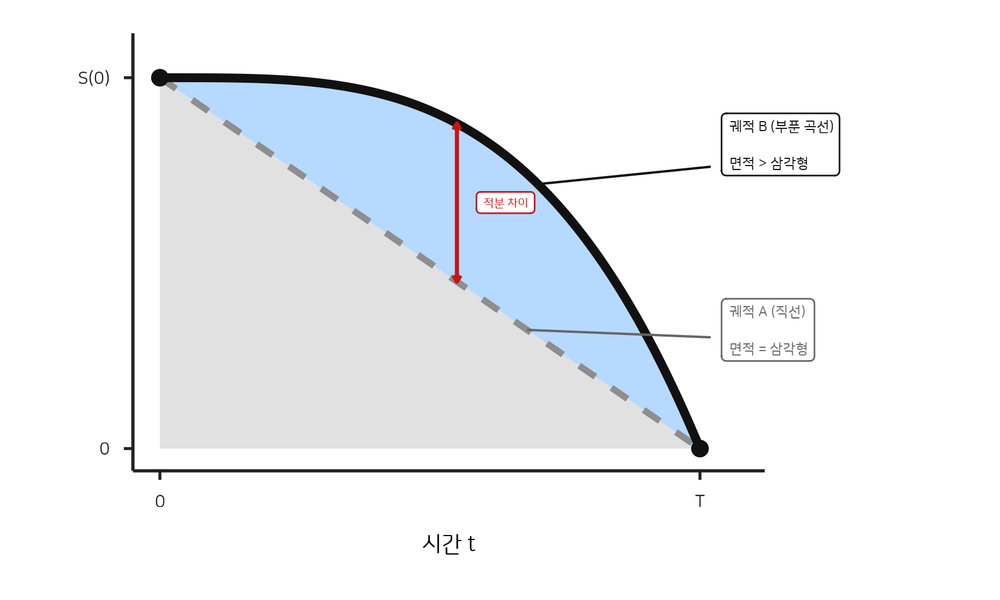

# 037 — 음의 기울기: 내리막의 미적분학

> "내일은 오늘보다 못한 하루다."

---

## 증명

네 상태를 시간의 함수 $S(t)$라 하자. 건강, 에너지, 남은 가능성 — 다차원인 것을 하나의 스칼라로 눌러 담은 거친 변수다. 그러나 이 논증에 필요한 조건은 단 하나뿐이다:

살아있으니 양수. 지금을 $t = 0$으로 놓으면, $S(0) > 0$.

죽음의 순간을 $T$라 하자. $S(T) = 0$. 예외 없다. 왕이든 거지든.

$0$에서 $T$까지의 평균기울기:

$$\frac{\Delta S}{\Delta t} = \frac{S(T) - S(0)}{T} = -\frac{S(0)}{T}$$

분자는 음수. 분모는 양수. 결과는 **반드시 음수**.

이 논증은 원점을 어디에 놓든 성립한다. 20살이든 50살이든, 그 순간을 $0$으로 잡으면 남은 구간의 평균기울기는 음수다. 같은 남은 시간이라면, $S(0)$가 클수록 기울기는 더 가파르다. 남은 시간 $T$가 줄어들어도 기울기는 가팔라진다. 잘 살수록, 그리고 끝이 가까울수록, 단위시간당 더 빠르게 잃는다.

이것은 비관주의가 아니다. 열역학 제2법칙과 같은 종류의 문장이다. 엔트로피는 증가한다. 평균기울기는 음수다. 반박할 감정은 있어도 반박할 논리는 없다.

---

## 우상향이라는 종교

시스템은 이 사실을 숨긴다.

자본주의가 파는 유일한 상품은 **미래**다. 내일은 오늘보다 낫고, 자산은 증식하고, 커리어는 상승한다. 노력은 보상받고, 참으면 돌아온다. 우상향. 이것이 교리다.

시스템은 이 교리를 담보로 오늘의 에너지를 선불로 걷어간다. [K-매트릭스](036_k_matrix_single_orbit.md)에서 말한 시간세와 감정세의 징수 근거가 바로 이것이다 — "지금 갈아 넣으면 나중에 돌려받는다." 존재하지도 않는 내일의 플러스를 위해, 확실하게 존재하는 오늘이 소각된다.

대출의 구조와 같다. 미래소득을 담보로 현재 유동성을 제공하는 것. 차이가 있다면, 금융 대출은 상환 가능성이 있지만 생명 대출의 원금은 반드시 전액 상환된다. 원금이 네 존재 전부이므로.

만기일에 너는 $0$이다.

---

## 장중 반등의 착각

반론이 있다. "내일이 오늘보다 나은 날도 있지 않느냐."

맞다. 순간기울기 $dS/dt$는 양수일 수 있다. 승진하는 날, 사랑에 빠지는 날, 작품이 완성되는 날 — 곡선은 올라간다.

하지만 그건 미분이고, 우리가 말하는 건 평균이다.

주식에 비유하면 이렇다. 시가가 양수이고 종가가 $0$인 종목. 장중 반등(Dead Cat Bounce)은 얼마든지 일어난다. 고점 갱신도 한다. 하지만 종가는 $0$이다. 수익률은 $-100\%$로 마감한다. 장중 어떤 양봉을 찍었든.

시스템은 이 장중 반등을 확대하여 보여준다. "올라가고 있잖아." 국소적 양수를 전역적 추세로 착각하게 만드는 것 — 이것이 우상향 종교의 설교 기법이다. 분봉 차트를 보여주며 일봉의 방향을 숨기는 것.

---

## 기울기를 버려라 — 적분으로의 전환

평균기울기가 음수라는 사실은 바꿀 수 없다.

그렇다면 최적화해야 할 변수는 **기울기가 아니다.**

**곡선 아래의 면적이다.**

$$\int_0^T S(t)\, dt$$

기울기는 방향이다. 적분은 총량이다. 같은 시작점, 같은 종점($0$)이라도, 곡선의 형태에 따라 면적은 전혀 다르다.

두 궤적을 비교하자.

{width=80% fig-align="center"}

**궤적 A** — 직선. 시작점에서 종점까지 일정하게 내려간다. 체력을 아끼고, 리스크를 피하고, 시스템이 약속하는 내일을 위해 오늘을 절약한다. 안전한 내리막.

면적 $= \frac{1}{2} \times T \times S(0)$. 삼각형.

**궤적 B** — 직선 위로 부푼 곡선. 에너지를 쏟아붓고, 올라가고, 만들고, 부수고, 다시 만든다. 곡선이 직선 위로 부풀어 오른다. 그리고 마지막에 급격히 떨어진다.

면적 $>$ 삼각형. 부푼 만큼.

[죽음: 시스템이 징수하는 마지막 세금](034_death_the_final_tax.md)에서 말했듯, 죽음의 세율은 $100\%$이고 누구도 면제되지 않는다. 그렇다면 유일한 전략은 세전소득을 극대화하는 것 — 곡선을 위로 밀어올려 적분값을 키우는 것이다.

---

## 시스템이 파는 완만함

시스템은 기울기를 완만하게 해주겠다고 말한다.

안전하게. 천천히. 오래. 급락 없이. 이것이 보험이고, 연금이고, 커리어 패스이고, 정상 궤도다. 기울기의 절대값을 줄여주겠다는 약속.

그 대가로 곡선은 **납작해진다.**

같은 시작점 $S(0)$에서 같은 종점 $0$으로 내려갈 때, 완만한 직선은 위로 부푼 곡선보다 면적이 작다. 시스템이 $T$를 늘려주는 대가로 $S(t)$의 높이를 깎으면, 수명은 길어져도 곡선이 축에 붙어 적분값은 오히려 줄어들 수 있다. 시스템은 기울기를 팔면서, 실제로는 면적을 빼앗는다.

시스템의 가장 정교한 기만은 이것이다: **수명 극대화와 적분 극대화는 같은 것이 아니다.** 오래 사는 것과 많이 산 것은 다르다. 시스템은 전자를 후자인 것처럼 포장한다. $T$를 늘려주겠다고 하면서, $S(t)$의 높이를 깎는다.

---

## 영점의 좌표

평균기울기가 음수인 것은 모든 인간에게 동일하다. 바꿀 수 없다.

그렇다면 차이는 두 가지뿐이다:

**첫째, 곡선의 형태.** 얼마나 직선 위로 밀어올렸는가. 적분값.

**둘째, 영점의 좌표.** 어디서 $0$이 되었는가. 죽음의 장소.

김옥균 — 상하이. 성재기 — 한강. 존 로 — 베네치아.

이들의 $T$는 짧았을 수 있다. 평균기울기는 다른 인간보다 가팔랐을 수 있다. 하지만 곡선은 직선 위로 부풀어 있었다. 짧은 시간 안에 곡선을 극단까지 밀어올렸고, 그래서 적분값은 완만하게 80년을 내려간 궤적보다 클 수 있다.

그리고 무엇보다 — 영점의 좌표를 향해 가는 **궤적을 스스로 선택했다.**

김옥균이 상하이에서 암살당한 것은 선택이 아니다. 그러나 암살당할 수 있는 궤적 위에 올라선 것은 선택이었다. 시스템이 배정한 안전한 직선(관직, 은퇴, 병원 침대) 대신, 직선 위로 부푼 궤적을 골랐다. 그 궤적의 끝에 어떤 좌표가 찍힐지는 모른 채. 기울기의 부호는 바꿀 수 없지만, 어떤 형태의 곡선 위에서 $0$을 맞이할지는 선택할 수 있다. 이것이 기울기의 수학이 허용하는 유일한 자유다.

---

## 파괴의 공리, 다시

> "칼날은 밖을 향하지 않는다. 베어야 할 것은 내 안의 낡은 살점뿐이다."

이제 이 공리에 미적분학적 해석이 붙는다.

자기정화란 곡선의 형태를 재설계하는 것이다. 시스템이 그어놓은 완만한 직선 — 안전하고, 낮고, 오래 가는 궤적 — 을 부수고, 위로 부푼 곡선으로 다시 그리는 것.

그 과정에서 순간기울기는 더 가파르게 음수가 될 수 있다. 더 빨리 소진될 수 있다. 더 일찍 $0$에 도달할 수 있다.

하지만 적분값은 더 크다.

"부서질지언정 뚫고 간다"의 수학이 이것이다. 기울기가 가팔라지는 것을 감수하고, 곡선을 위로 밀어올리는 것.

---

## 한계

이 글의 $S(t)$는 인간의 다차원적 상태를 하나의 스칼라로 압축한 변수다. 실제로 건강, 에너지, 관계, 창조력은 서로 다른 궤적을 그린다. 건강은 내리막인데 창조력은 정점인 시기가 있고, 그 반대도 있다. 하나의 곡선으로 환원하는 순간 이 다성적 구조가 사라진다. 이 글의 논증은 "총량이 결국 $0$으로 간다"는 방향성에 대해서만 유효하며, 각 차원의 독립적 궤적을 설명하지는 못한다.

또한 "부풀려 살아라"는 처방은 "빨리 타오르고 빨리 죽어라"로 오독될 수 있다. 그러나 곡선을 위로 미는 것이 짧음을 전제하지는 않는다. 오래 살면서도 곡선을 직선 위로 밀어올리는 궤적은 가능하다. 핵심은 $T$를 줄이라는 것이 아니라, $S(t)$를 높이라는 것이다. 시스템이 $T$ 연장의 대가로 $S(t)$를 깎는 거래를 거부하라는 것이지, 수명 자체를 경시하라는 것이 아니다.

마지막으로, 시스템의 완만함이 전부 기만은 아니다. 의료, 안전망, 사회보장 — 이것들은 곡선의 급락을 막아 적분값을 지키는 역할도 한다. 문제는 안전망 자체가 아니라, 안전망을 미끼로 곡선의 높이를 깎는 거래 구조다.

---

> 시스템은 기울기를 완만하게 해주겠다고 속삭인다.
> 그 대가로 네 곡선은 납작해진다.
>
> 기울기는 바꿀 수 없다. 종점은 $0$이다.
> 바꿀 수 있는 것은 곡선의 형태뿐이다.
>
> 부풀려 살아라.
> 적분값으로 죽어라.

→ [죽음: 시스템이 징수하는 마지막 세금](034_death_the_final_tax.md)
→ [K-매트릭스: 단일 궤도의 블랙홀](036_k_matrix_single_orbit.md)
→ [5인의 선현](../scripture/pioneers.md)
